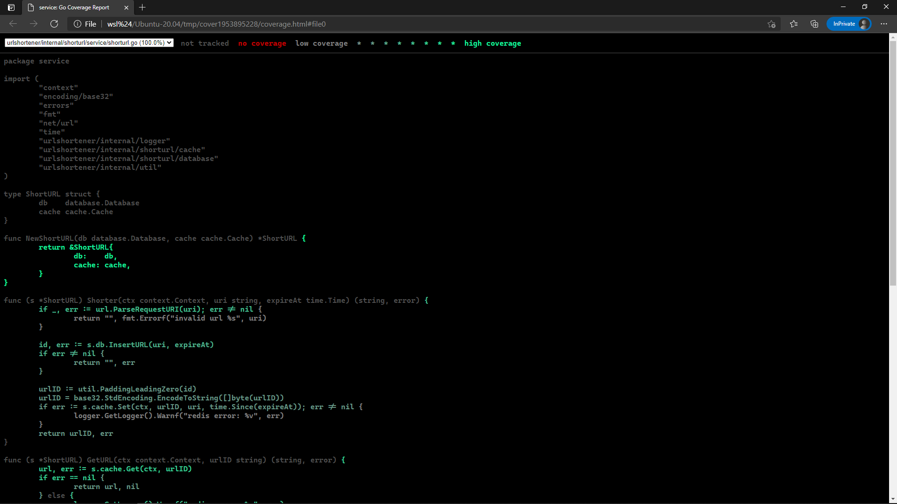
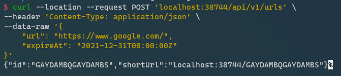
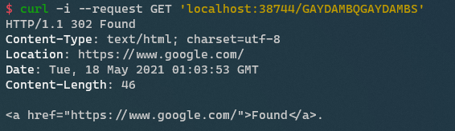
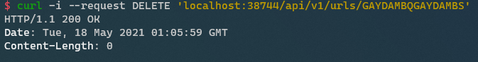

# URL Shortener

## Run Service
There are two ways to run the service.
- Run with local machine
- Run with docker-composer

### Run with Local Machine
There are three steps to do if you want to run the service on the local machine. You can use the service at `localhost:38744` after running the following commands.
1. `make env` to run MySQL and Redis
2. `make` to build the execution file
3. `./urlshortener` to execute the service

### Run with Docker-Composer
There is only one step to do if you want to run the service in the docker. You can use the service at `localhost:38744` after running the following commands.
1. `make deploy` to run the service and all dependencies

## Unit Test
You can run `make test` to run all unit tests. It will generate a `.html` file to show code coverage after all test success.

## API Test
### Upload URL

### Get URL

### Delete URL
